# Hotels Booking

Hotels Booking is a sophisticated web application designed to streamline the hotel booking process for users worldwide. Our goal is to provide a user-friendly platform that simplifies hotel reservations, making it convenient for travelers to find and book accommodations seamlessly. By offering a wide range of features and functionalities, Hotels Booking aims to enhance the overall booking experience, empowering users to discover and book their ideal accommodations with ease.

[Explore the live site here](https://ci-fsf-hotel-booking-ae5af0acfb8b.herokuapp.com/)

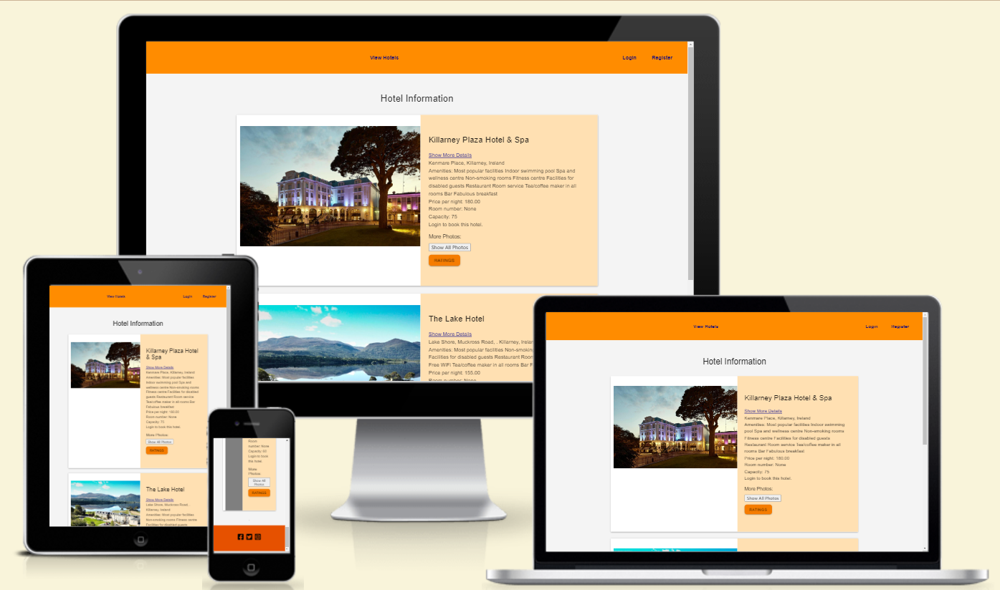

## Table of Contents

* [UX / UI](#ui-/-ux)
* [Features](#features)
* [Database Design](#database-design)
* [Technologies Used](#technologies-used)
* [Testing](#testing)
* [Deployment](#deployment)
* [Credits](#credits)

## UI / UX

The Hotels Booking website focuses on delivering a clean and intuitive user experience, ensuring ease of use for visitors of all ages. The design emphasizes simplicity and clarity to facilitate smooth navigation and efficient interaction.

- **Clean and Intuitive Design:** The website features a minimalist design aesthetic, avoiding unnecessary clutter and distractions to maintain a clear focus on essential elements.

- **Easy Navigation:** Intuitive navigation elements are incorporated to guide users seamlessly through the website's various sections and functionalities. Clear menus and organized layout enhance the overall user experience.

- **Responsive Layout:** The website is designed to be responsive, ensuring compatibility across different devices and screen sizes. This responsiveness optimizes the user experience on both desktop and mobile platforms.

- **Accessible Color Scheme:** A carefully chosen color scheme ensures accessibility for all users, including those with visual impairments. High contrast and legible text contribute to improved readability and usability.

- **Efficient Booking Process:** The booking process is streamlined and user-friendly, allowing visitors to easily search for accommodations, view details, and make reservations without encountering unnecessary hurdles.

- **Visual Consistency:** Consistent visual elements and layout across pages maintain a cohesive user experience, enabling visitors to navigate the website confidently and intuitively.

- **Optimized Performance:** The website is optimized for performance, ensuring fast loading times and smooth interactions to minimize user frustration and enhance overall satisfaction.

### Agile Methodology

The project adopts an Agile methodology for efficient project planning and management, utilizing GitHub Projects as the primary tool for organizing and tracking progress.

- **Project Board:** The project board, accessible [here](https://github.com/users/AnwarDawoud/projects/2), serves as the central hub for organizing and visualizing project tasks. It provides a clear overview of the project's current status and upcoming milestones.

- **Epics and User Stories:** Work is organized into Epics, which represent high-level features or components of the project. Each Epic contains multiple User Stories, which are detailed descriptions of specific functionalities or tasks that contribute to the completion of the Epic.

- **Task Breakdown:** User Stories are further broken down into individual tasks, each with its own set of requirements and acceptance criteria. This breakdown allows for better management of tasks and ensures that progress can be tracked at a granular level.

- **Priority and Status:** Tasks are categorized based on priority and status, allowing team members to easily identify which tasks need immediate attention and which ones are in progress or completed. This classification helps streamline workflow and ensures that critical tasks are addressed promptly.

- **Collaboration and Communication:** GitHub Projects facilitate collaboration and communication among team members by providing a centralized platform for discussing tasks, sharing updates, and resolving issues. The commenting feature allows for real-time communication and feedback exchange.

- **Adaptability:** The Agile methodology promotes adaptability to changing requirements and priorities. GitHub Projects offer flexibility in adjusting task priorities, adding new User Stories, and accommodating feedback throughout the project lifecycle.

- **Continuous Improvement:** Regular review and retrospective sessions enable the team to reflect on their progress, identify areas for improvement, and implement changes to enhance project efficiency and effectiveness. These sessions foster a culture of continuous improvement and learning within the team.

## User Stories

1. **Log In:**
   - As a user, I can log in to my account so that I can access personalized features and manage my bookings.

2. **Add New Hotel:**
   - As a hotel manager, I can add a new hotel listing so that I can make it available for users to book.

3. **View Available Hotels:**
   - As a traveler, I can view a list of available hotels so that I can choose the one that best fits my preferences.

4. **Register:**
   - As a new user, I can register for an account so that I can save my preferences and manage my bookings.

5. **View Dashboard (Hotel Manager):**
   - As a hotel manager, I can view a dashboard so that I can monitor the performance of my hotels.

6. **View Dashboard (User):**
   - As a user, I can view a dashboard so that I can manage my bookings and preferences.

7. **Book Hotel:**
   - As a user, I can book a hotel so that I can secure my accommodation for a chosen date.

8. **Reset Password:**
   - As a user, I can reset my password so that I can regain access to my account in case I forget my password.

9. **Rate Hotel Experience:**
   - As a user, I can rate my hotel experience so that I can provide feedback to improve services.

10. **Manage Bookings (Hotel Manager):**
    - As a hotel manager, I can manage bookings so that I can ensure a smooth check-in and check-out process for guests.

## Wireframes

The wireframes depicted here illustrate the initial concept and planning stages of the project. Please note that adjustments and new features may have been incorporated during the development process.

<details><summary>Client Dashboard</summary>
  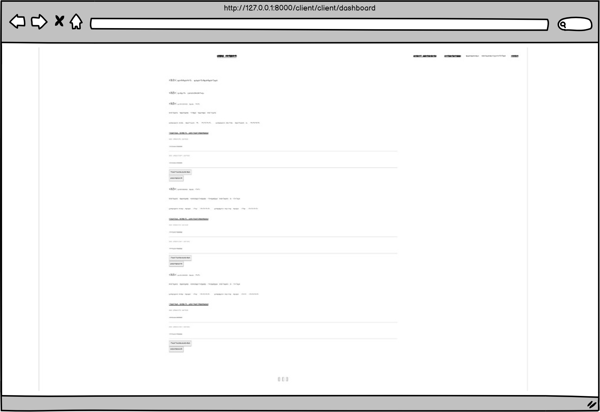
</details>

<details><summary>Hotel Manager - Add Hotel</summary>
  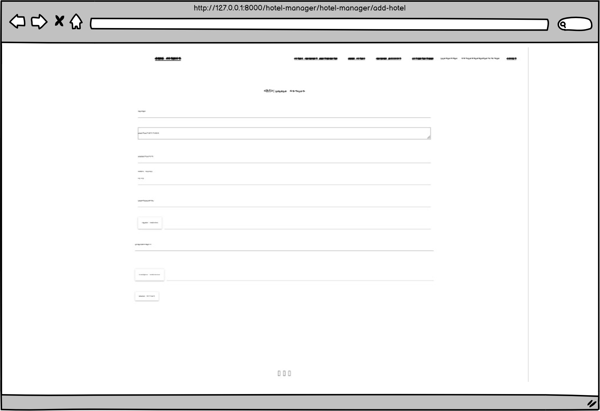
</details>

<details><summary>Hotel Manager Dashboard</summary>
  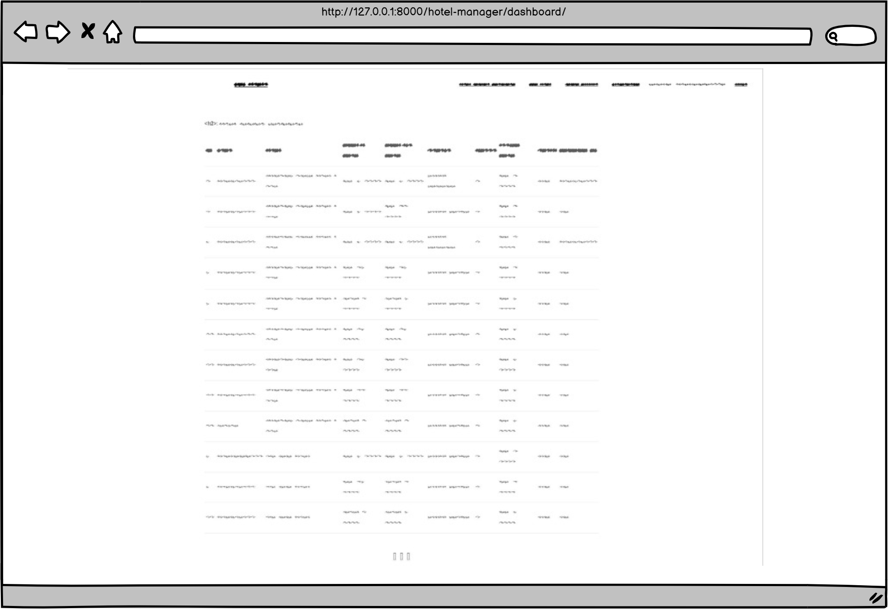
</details>

<details><summary>Login</summary>
  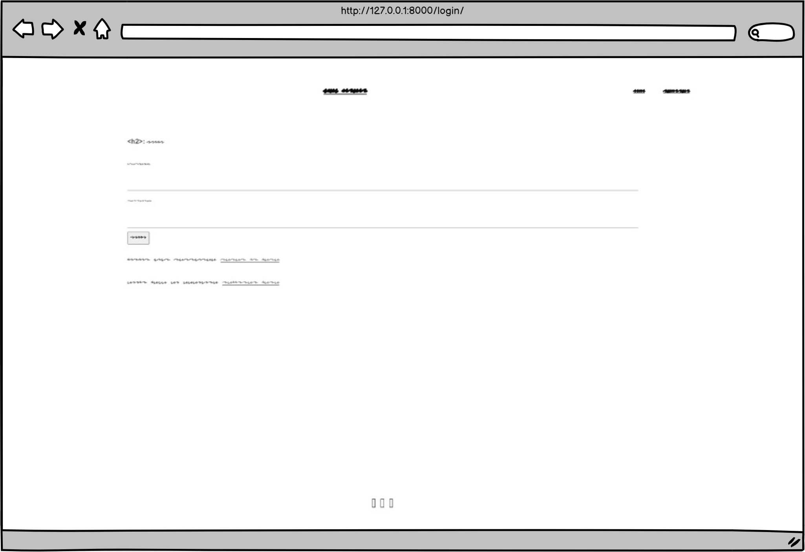
</details>

<details><summary>Register</summary>
  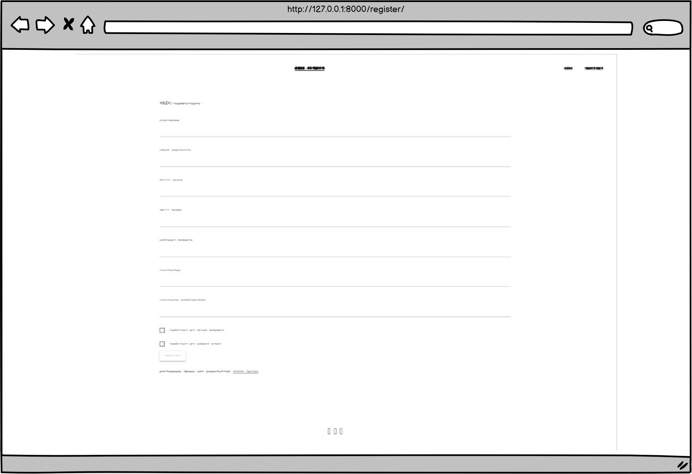
</details>

<details><summary>View Hotels</summary>
  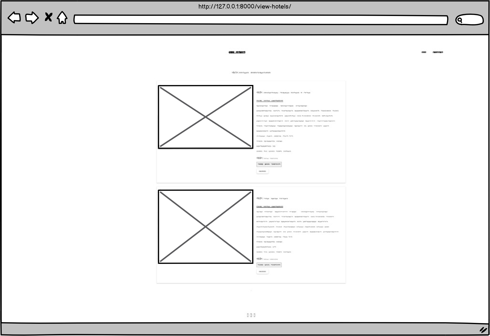
</details>

### Design Choices

All pages are responsive, following a mobile first approach.

#### Colors

I've curated the color palette focusing on earthy and natural tones. These colors create a harmonious and inviting visual experience for the web application.

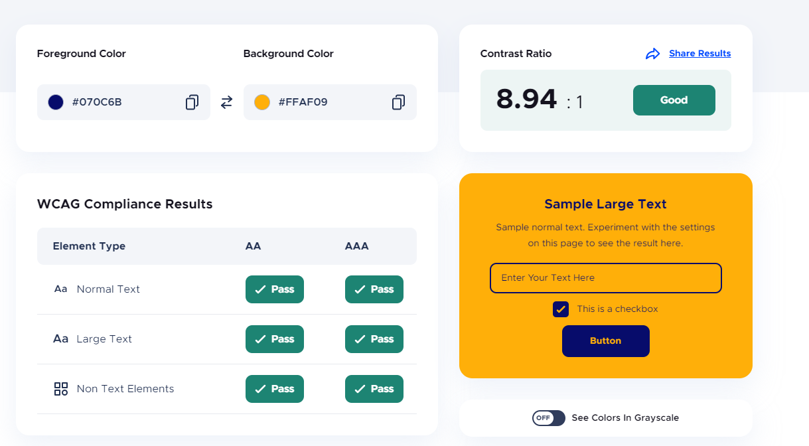

Besides the colors from the palette, Off-lavender is consistently employed as the background for headers, footers, and cards across the site. The palette colors are thoughtfully used for buttons and links, ensuring a harmonious and contrast-rich design that complements the backgrounds.

## Features

All features have been prioritized and developed in response to the needs outlined in the user stories during the planning stage.

## Database Design

The Entity-Relationship Diagram (ERD) has been extracted from SQLite.

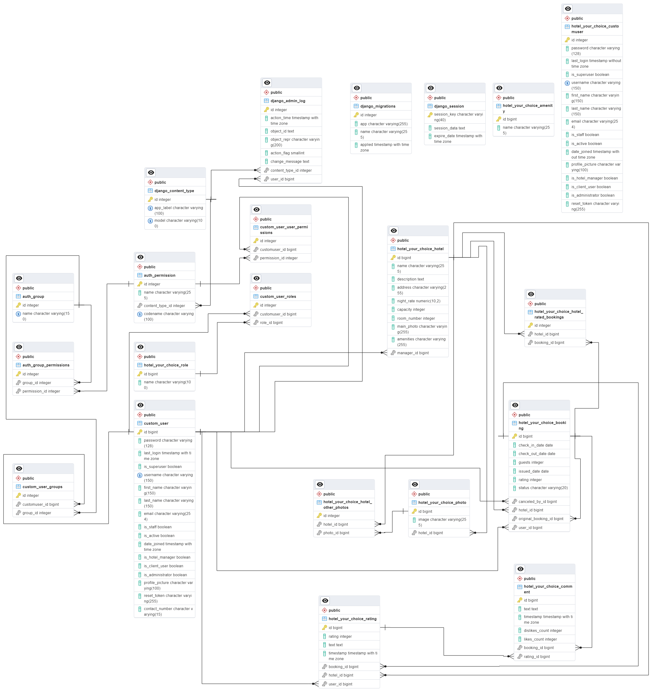
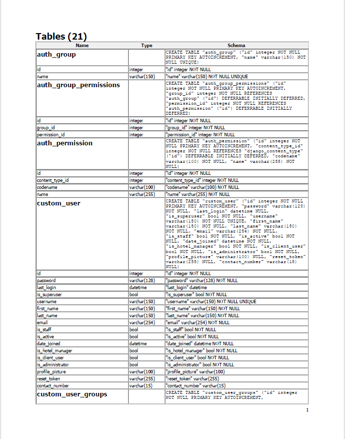
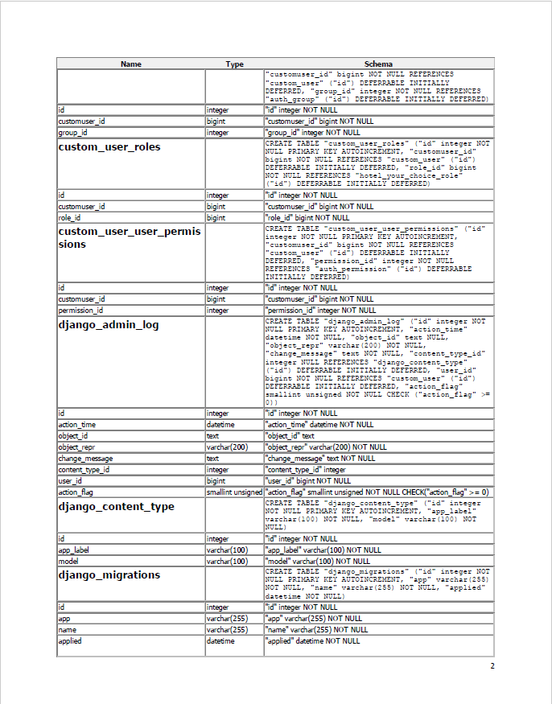
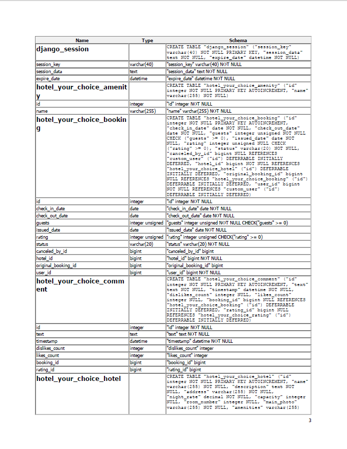

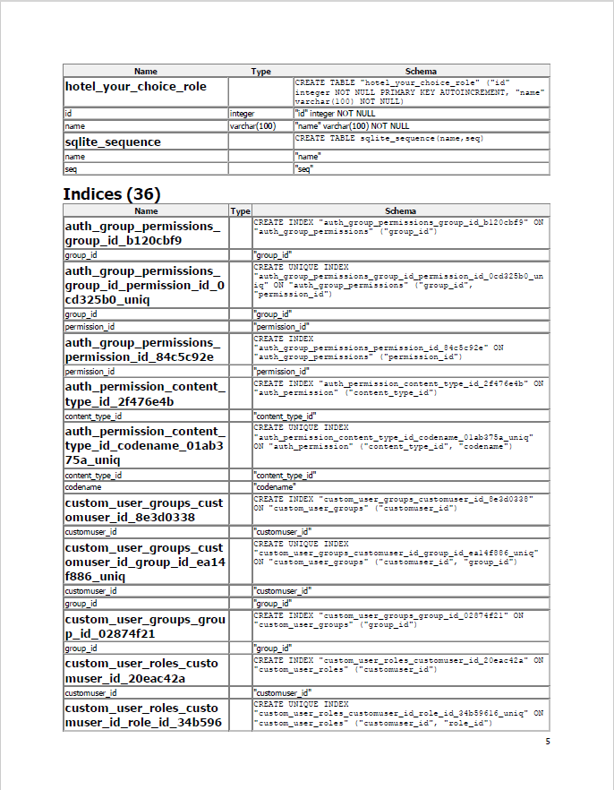
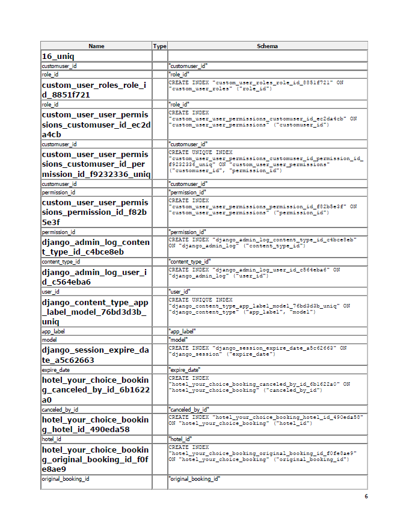
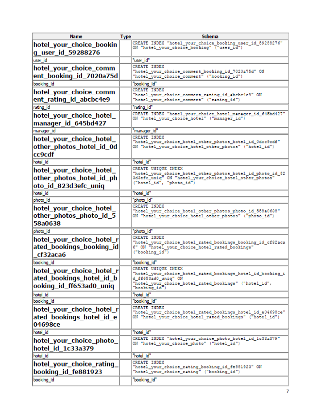
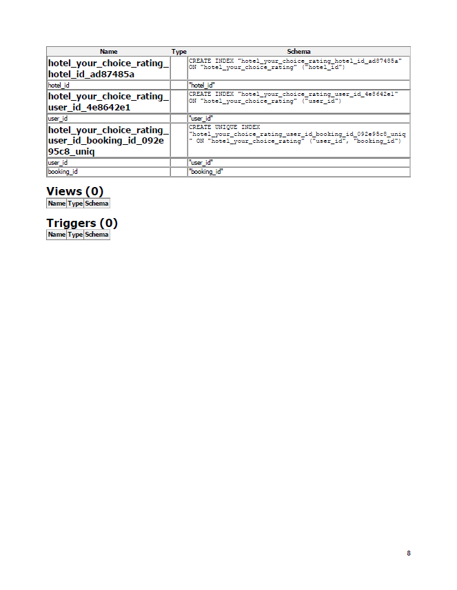

### CRUD

Only logged in users have the possibilty to create, update and delete. Not registered or logged in users can only read information.

When a user signs in, a profile is automatically created and the first_name field is populated with the username. Users can edit their booking / entities.

Logged in users can create (add) hotels. Once created, users can also edit or delete them.

## Technologies Used

### Languages

- HTML5

- CSS

- Python

- JavaScript

### Frameworks

- [Django](https://www.djangoproject.com/) 4.2.6 is the web framework used to build the application.

### Libraries and Dependencies

- [allauth](https://docs.allauth.org/en/latest/#) for registration and authentication.

- [gunicorn](https://gunicorn.org/) is the WSGI HTTP server used.

- [psycopg2](https://pypi.org/project/psycopg2/) as an adapter used for database connectivity.

- [dj-database](https://pypi.org/project/dj-database-url/) to simplify database management.

- [cloudinary](https://cloudinary.com/) for serving media files.

- [elephantsql](https://www.elephantsql.com/) as the PostgreSQL database for production.

### Hosting and Deployment

- [Heroku](https://www.heroku.com/) to host and deploy the application.

### Other Technologies

- Git was used for version control.

- [GitHub](https://github.com) to host the code.

- [VScode]Visual Studio Code (VSCode) was utilized as the Integrated Development Environment (IDE) for the development of the website. VSCode provides a robust set of features and extensions that facilitated the development process and allowed for efficient coding, debugging, and collaboration among team members.

- [Balsamiq](https://balsamiq.com/wireframes) to create the wireframes.

- [Google Fonts](https://fonts.google.com) to import Montserrat and Lato fonts.

- [Font Awesome](https://fontawesome.com) to import icons.

- [Favicon](https://favicon.io/) to create the favicon files and links.

## Testing

The full testing documentation can be found in [TESTING.md](TESTING.md)

## Deployment

This site has been deployed to Heroku, using ElephantSQL database and Cloudinary, following these steps:

1. Installing Django and supporting libraries

    - Install Django and gunicorn
    - Install supporting database libraries: dj_database_url and psycopg2
    - Install Cloudinary libraries: dj-3-cloudinary-storage
    - Create requirements file
    - Create Django project
    - Create first app
    - Add app to installed apps in settings.py file
    - Migrate changes
    - Run the server to test if the app is installed

2. Create the Heroku App
    - Log into Heroku and go to the Dashboard
    - Click “New" and then “Create new app”
    - Choose an app name and select the region closest to you. Then, click “Create app” to confirm.

3. Create an external database with ElephantSQL

    - Log into ElephantSQL
    - Click "Create New Instance"
    - Set up a plan by giving a Name and selecting a Plan
    - Click "Select Region" and choose a Data center
    - Click "Review", check all details and click "Create Instance"
    - Return to the Dashboard and click on the database instance name
    - Copy the database URL

4. Create an .env file to avoid exposing sensitive information

    - In the project workspace, create a file called env.py. Check that the file name is included in the .gitignore file
    - Add ``import os`` to env.py file and set environment variable DATABASE_URL to the URL copied from ElephantSQL ``os.environ["DATABASE_URL"]="<copiedURL>"``
    - Add a SECRET_KEY environment variable ``os.environ["SECRET_KEY"]="mysecretkey"``

5. Upate settings.py

    - Add the following code below the path import in ``settings.py`` to connect the Django project to env.py:
        ````
        import os
        if os.path.isfile("env.py"):
            import env
        ````
    - Remove the secret key provided by Django in settings.py and refer to variable in env.py instead (``SECRET_KEY = os.environ.get('SECRET_KEY')``)

    - Optional: To keep using the sqlite database in the development environment as well as as having Debug on, but off in production and use the new database, create a new variable called DEVELOPMENT at the top of settings.py. This means that if there's an environment variable called DEVELOPMENT in the environment this variable will be set to its value. And otherwise, it'll be false. 
        ````
        development = os.environ.get('DEVELOPMENT', False)
        ````

    - To connect to the new database for production and keep sqlite for development, replace the provided DATABASE variable with 
        ````
        if development:
            DATABASES = {
                'default': {
                    'ENGINE': 'django.db.backends.sqlite3',
                    'NAME': BASE_DIR / 'db.sqlite3',
                }
            }
        else:
            DATABASES = {
                'default': dj_database_url.parse(os.environ.get('DATABASE_URL'))
            }
        ````
    - Save and migrate all changes

6. Heroku Config Vars

    - Go back to Heroku dashboard and open the Settings tab
    - Add two new config vars: DATABASE_URL, with the value of the database, URL and SECRET_KEY, with the value of the secret key string

7. Set up Cloudinary for static and media files storage

    - In the Cloudinary dashboard, copy the API Environment variable
    - In ``env.py`` file, add new variable ``os.environ["CLOUDINARY_URL"] = "<copied_variable"``, without "CLOUDINARY_URL="
    - Add the same variable value as new Heroku config var named CLOUDINARY_URL
    - In ``settings.py``, in the INSTALLED_APPS list, above ``django.contrib.staticfiles`` add ``cloudinary_storage``, below add ``cloudinary``
    - Connect Cloudinary to the Django app in settings.py:

        ```
        STATIC_URL = '/static/'
        STATICFILES_STORAGE = 'cloudinary_storage.storage.StaticHashedCloudinaryStorage'
        STATICFILES_DIRS = [os.path.join(BASE_DIR, 'static')]
        STATIC_ROOT = os.path.join(BASE_DIR, 'staticfiles')

        MEDIA_URL = '/media/'
        DEFAULT_SITE_STORAGE = 'cloudinary_storage.storage.MediaCloudinaryStorage'
        ```

    - Change the templates directory to TEMPLATES_DIR. Place within the TEMPLATES array: 'DIRS': [TEMPLATES_DIR]
    - Add Heroku Hostname to ALLOWED_HOSTS

        ```
        if development:
            ALLOWED_HOSTS = [os.environ.get('LOCALHOST')]
        else:
            ALLOWED_HOSTS = [os.environ.get('HEROKU_HOSTNAME')]
        ```

8. Create Procfile

9. Heroku Deployment:

    - Click Deploy tab in Heroku
    - In the 'Deployment method' section select 'Github' and click 'Connect to Github'
    - In the 'search' field enter the repository name
    - Connect to link the heroku app with the Github repository
    - Click "Deploy Branch" or enable "Automacti Deploys"

### How to Clone the Repository

To clone the repository and get the project on your local machine, follow these steps:

1. Go to the [GitHub repository](https://github.com/AnwarDawoud/ci-fsf-hotel-booking).

2. Click on the "Code" dropdown button, then select "HTTPS" and copy the provided URL to the clipboard.

3. Open a terminal (GitBash recommended) on your computer.

4. Navigate to the directory where you want to clone the repository using the `cd` command.

5. Type `git clone` followed by the copied Git URL and press Enter.

   ```bash
   git clone <copied-git-url>

### How to fork the Project

- Go to [GitHub repository](https://github.com/AnwarDawoud/ci-fsf-hotel-booking).
- Click the fork button on the top right of the page
- A forked copy of the repository will appear in your Repositories.

### Credits

**Content:**  
All content was originally created and written by Anwar Dawoud, the developer.

**Media:**  
The main image, referred to as the Hero picture, and all photos related to the projects section were collected from real hotels at [www.booking.com](https://www.booking.com).

**Code:**  
Code snippets and techniques for Django projects were sourced from various online tutorials, the official Django documentation, and materials provided by Code Institute.

### Acknowledgements

I would like to express my gratitude to the following:

- **Code Institute and Slack Community:** Thank you for the continuous support throughout this project.

- **Jack (Mentor):** Special thanks for your kind assistance and valuable time.

- **My Family:** I am grateful for their support and understanding, allowing me the time to work on this project.

- **Ahmed Dawoud (Brother):** Thank you to my brother Ahmed Dawoud, who works as an IT project manager, for his valuable insights and guidance.

_**_I wish the project met the criteria required by Code Institute**_
